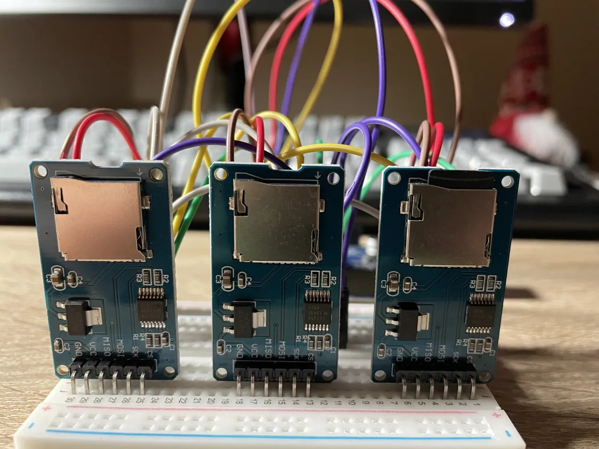
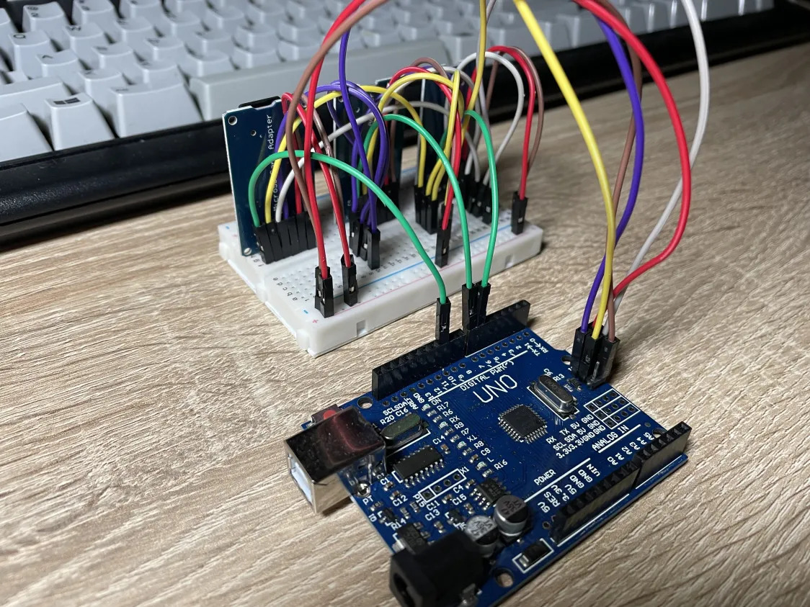
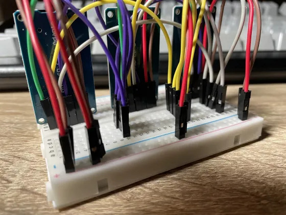

SD RAID: hardware RAID on SD cards for AVR
============================================

#### Foreword

SD code ([sd.c](./sd.c)) is partly taken from [here](https://github.com/i350/ATMEGA328P-SD-Card-FAT32-SPI-ATMEL-Studio/tree/master).

It is cleaned up and styled a ~~bit~~ lot.

Code is written in C99, uses BSD KNF / Solaris C style, assuming 8-character wide
tab.

It is assumed that the cards are SDHC.

## Project output

Goal of this project is to have a working storage abstraction allowing redundancy
using classic RAID techniques like mirroring and keeping parity invariant.

As a proof of concept there is a Linux client ([ctl.c](./ctl.c)) which provides
an interface to the SDRAID via interactive menus, supporting: creation, assembly,
uploading/downloading of a single file, and debug reads.

## Documentation

### Pins

SPI is connected to ICSP on ARDUINO UNO clone
[scheme 1](https://jgaurorawiki.com/_media/a5/arduino-icsp.jpg)
or [scheme 2](https://www.olimex.com/Products/AVR/Programmers/AVR-ICSP/resources/AVR-ICSP.gif)
.

`MISO`, `MOSI`, and `SCK` lines are shared amongst all SD card modules.

`Slave select`s are connected to `PB2`, `PB1` and `PB0` (Arduino pins 10, 9 and 8)
(see [<spi.h>](./spi.h)).

### Building

To build SDRAID run `make`, to upload it, run `make upload`.

After it has been written to the chip, run `make ctl` to build and run the control
client.

Requirements:

- `Linux`
- `gcc`
- `avr-gcc`
- `avr-objcopy`
- `avrdude`
- GNU or BSD `make`

The [Makefile](./Makefile) assumes the following:

- your Atmega328P(B)'s serial port is `/dev/ttyUSB[0-9]*`
  - that is for the ease of automatic passing of the serial port to
    the used programs (`avrdude`, and the control client)

### Terminology

I call:
- the RAID array a **volume**,
- the underlying SD cards **extents**,
- superblock and **metatada** interchangeably

### Interface

For the ease of demonstration there is a client that
takes commands from `stdin` and sends them to the arduino
via serial. The client supports these commands:

- all modes:
  - `flush` - flushes uart read buffer
- initialize mode:
  - `create` - create new volume and write metadata
  - `assemble` - assemble volume from metadata
- normal mode:
  - `pwd` - print current working directory
  - `ls` - list current working directory
  - `cd <path>` - change working directory
  - `put <file>` - writes file to the volume
  - `get <file>` - reads volume contents into file
  - `debug` - switches to debug mode
- debug mode:
  - `read` - reads single block from volume
  - `read2` - reads single block from specified sd
  - `exit` - exits back into normal mode

For simplicity there is only one file kept at once.

For developing own interfaces using classic R/W see `blkdev_ops_t` in [<var.h>](./var.h).

### File tree

```
.
├── Makefile
├── README.md
├── common.h         <-- common header for sdraid and client
├── ctl.c            <-- control client
├── cyclic-writer.c  <-- testfile generator
├── main.c           <-- proof of concept interface
├── photos
│   ├── sdraid1.jpg
│   ├── sdraid2.jpg
│   └── sdraid3.jpg
├── raid0.c          <-- striping functions
├── raid1.c          <-- mirroring functions
├── raid5.c          <-- striping with parity functions
├── sd.c             <-- SD card commands
├── sd.h
├── sdraid.c         <-- main sdraid functions
├── sdraid.h
├── spi.c            <-- SPI control
├── spi.h
├── testfiles
│   └── cyclic10.txt
├── uart.c           <-- serial communication
├── uart.h
├── util.c           <-- helper functions
├── util.h
└── var.h            <-- main structures and constants
```

### Metadata

During volume creation there is a superblock written to all
extents, which holds the volume configuration:

```c
typedef struct metadata {
	char magic[6];
	uint8_t version;
	uint8_t devno;
	uint8_t level;
	uint8_t layout;
	uint8_t strip_size_bits;
	uint32_t blkno;
	uint32_t data_blkno;
	uint8_t data_offset;
	uint8_t index; /* currently not used */
	uint32_t file_size;
} __attribute__((packed)) metadata_t;
```

```
+--------------+ <- LBA 3
|   SDRAID     |
|  Superblock  |
+--------------+ <- LBA 4
|              |
|              |
|    Data      |
|              |
|              |
|              |
|              |
+--------------+
```

- metadata is not synced
- when assembling an already created volume, it is assumed that the ordering
  of SD cards is the same as the order the volume was originally created with

## Photos

#### Cable colors

```
GREEN: SS
YELLOW: SCK
GREY: MOSI
PURPLE: MISO
RED: VCC
BROWN: GND
```

These pictures are outdated, currently there are different modified SD card modules
used due to the pull up resistors causing trouble (might upload new photos in the future).




